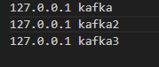

# note
笔记

# 注意
连接kafka 需要在我们的hosts 里面配上映射关系 集群的时候需要使用kafka集群的名称 不能使用localhost 

# kafka
## 分区
将我们的数据分开来存储 比如在 一个分区中存储 2020 年的数据，在另一个分区中存储 2019 年的数据，这样在查询的时候就可以根据分区键来查询，从而提高查询效率。

## 副本
将数据复制多份，这样在某个节点宕机的时候，数据也不会丢失，从而提高了数据的可靠性。
