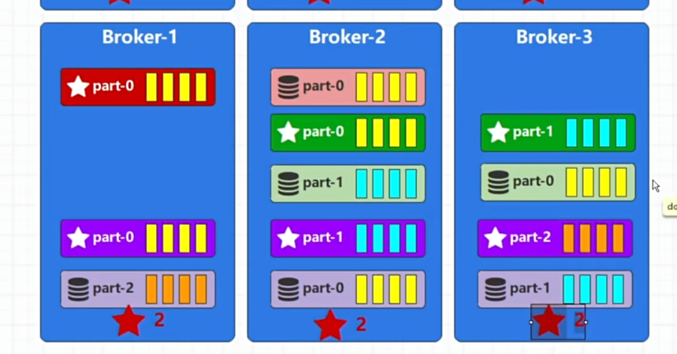

# windows下安装Kfaka

1. 首先下载一个php的rd-kafka的扩展，并且添加到php.ini的配置文件中去
   1. 将php_rdkafka.dll放在php 的ext 文件中
   2. 将librdkafka 放在php 的安装目录下，然后重启php web服务器就可以了
   3. 增加rdKafka的ide 提示 使用 composer require kwn/php-rdkafka-stubs --dev
2. 下载kafka 文件，在kafka文件中自带了zookeeper，不需要我们再去额外的进行下载
   1. 配置zookeeper 配置文件 
      config 里面的 zookeeper.properties  
   2. 


线程和线程之间的数据交互


## 报错注意点如果报错：

%3|1733654993.779|FAIL|rdkafka#producer-1| [thrd:kafka:9092/1003]: kafka:9092/1003: Failed to resolve 'kafka:9092': ��֪��������������  (after 2725ms in state CONNECT)
%3|1733654993.779|ERROR|rdkafka#producer-1| [thrd:app]: rdkafka#producer-1: kafka:9092/1003: Failed to resolve 'kafka:9092': ��֪��������������  (after 2725ms in state CONNECT)

需要在windows 下的  C:\Windows\System32\drivers\etc\hosts 里面配上 127.0.0.1  kafka


进程和进程之间的数据交互


因为接受和发送长时间不均衡导致数据积压，从而导致资源被大量的消耗进而对系统的吞吐量产生影响。


# 为什么要使用Kafka

因为我们的线程和进程之间的通信会因为上面的原因从而导致出现问题。我们可以引入一个缓冲区来解决这个问题，先将数据发送到我们的缓冲区里面去，然后要接受数据的从缓冲区里面获取数据。


producer   生产者

consumer    消费者

topic  主题

record  记录

broker  服务阶段(集群) 代理，中介

partition  分区(编号)

offset   偏移量  

rabbitmq、acticvemq、rocketmq  这三种都是遵循着  message queue 协议的 

kafka  在 message queue 上做了自己的扩展 所以 mq 标识

副本： leader  、 follower


P2P（点对点）

producer -> consumer      consumer 接收到消息之后会像 producer 返回一个 feedback 反馈 接收到信息


PS （发布订阅模型）

topic  主题 


kafka 数据里面的消息有一个标识他的唯一标志叫做 offset  消费者在进行消费的时候可以通过 这个 offset 来指定消费某一条记录(record)

kafka-broker    提供服务的节点


zookeeper  2181端口


## 使用kafka 

先将 zookeeper 的 配置文件里面 datadir 的配置(zookeeper.properties)改为我们想要保存zookeeper 数据的目录下、

先启动 zookeeper 

再修改server.propertises 配置文件 下 log.dirs 配置kafka数据存放位置。

在启动 kafka   默认端口 9092


## 横向扩展

添加多台机器，每台机器启一个服务来进行处理

## 纵向扩展

将我们的服务放在多个机器上，通过 分区(partition)和 topic 来进行文件的归纳，方便我们消费者来进行消费。


因为我们进行扩展每一个机器上都会有一个 相同的topic 因为每个机器上相同的topic 是一个整体所以 我们要来对不同机器上的 topic 的区域进行区分 就有了分区的概念(partition)。


## kafka的存储

kafka就是一个日志处理中间件，所以他的数据是存在一个log文件中的。


kafka 的数据是存储在磁盘上面的，消费的也是磁盘上面的数据。

为了保证高可用性我们需要将每个机器上面的 log  文件进行备份，将当前机器上面的 log 文件也保持在当前集群的其他机器上，最多保存 n-1 个log 文件。 因为保存在自身是没有意义的。


### 分区

将同一个topic 存在在不同的 Kafka 服务器上面，这样来生产消息的时候将不同的消息生产到不同的机器上来保证我们服务的负载能力。


### <span id="备份">备份</span>

为了数据的可靠性，可以将数据文件进行备份，但是kafka 没有备份的概念。kafka 中称为 副本，多个副本中只能有一个提供读写操作。其他副本就是用来做备份的。

具有读写能力的副本称为  leader副本

作为备份的数据称为  follower副本


## 集群

集群 里面的 master 节点称为  controller

 

master 出现问题解决方案:

1. 将master 增加副本
2. 推荐：选举    使用 Zookeeper 来做选举功能


SocketServer(网络服务器)     NetworkClient(网络客户端)   用来各个组件之间进行通信。

replication Manager  副本管理器   管理副本文件，在controller 叫leader 副本   在其他的机器上叫 follower

Log Manager  日志管理   来管理日志文件 

ZKClient  （Zookeeper 客户端）  和  zookeeper 来进行通信


启动集群需要修改 server.properties 文件中的broer.id

kafka 集群是通过Zookeeper 来进行管理的

### 节点创建

ZNode  (Zookeeper节点)   只会创建一次   

- 持久化节点
- 临时节点

Zookeeper 的节点有 watch(监听) 功能  当监听的节点发送了变化会发起一个回调


选举节点的话，是通过**监听器**来实现的。

先创建的 kafka 节点就是 controller 节点，后创建的节点发现有了一个 controller节点就不会 再去创建节点了，而是通过创建一个监听器来监听集群状态，一旦controller 节点挂掉了其他的kafka 节点就会去发起创建controller 的请求，谁先创建controller 谁就是下一个 controller  ，同时其他的节点就继续监听集群状态。


kafka 大概在 4.0 的时候推出了自己的集群管理算法，移除了 zookeeper


# controller 和 broker 通信原理

## 第一个 broker 启动的流程

1. 注册broker节点  (创建一个broker 来提供服务)
2. 监听/controller 节点 (为了查看是否存在controller)
3. 注册/controller 节点 (当前broker 没有controller 需要注册一个 controller)
4. 选举成为controller ，监听/brokers/ids 节点。(获取集群节点信息)


## 第二个 broker 启动的流程

1. 注册broker节点  (创建一个broker 来提供服务)
2. 监听/controller 节点 (为了查看是否存在controller)
3. 注册/controller 节点   (因为存在 controller 存在创建失败)
4. 通知集群的变化
5. 连接broker，发送集群相关数据(分区，副本，controller 是谁...)


## 第三个 broker 启动的流程

1. 注册broker节点  (创建一个broker 来提供服务)
2. 监听/controller 节点 (为了查看是否存在controller)
3. 注册/controller 节点   (因为存在 controller 存在创建失败)
4. 通知集群的变化
5. 连接所有的broker，发送集群相关数据(分区，副本，controller 是谁...)


## controller 删除的情况


1. 通过监听器来判断，当前有哪些Kafka 是建立了连接的，如果Controller 的Kafka断开了连接。那么监听器就会去告知其他的Kafka 然后进行建立连接
2. 谁先建立连接谁就是Controller


# 第二部分是 controller 和 broker 的通信

通过 controller 的 client客户端 组件与 与  socketServer(网络服务器)  进行通信

socketServer  与  kafkaApis 进行通信  

请求和响应都是这样的。

里面有很多的队列和缓冲区，事件等。

kafkaApis  里面封装了具体的要执行的那些方法的实践

本质使用的模型都是消费者和生产者模型


# broker 组件


broker 有缓存的概念。


## 存储方式


星号的就是可以读写的数据

数据库的就是备份，只能读，不能写。

[备份](#备份)


in sync replicas     ISR  同步副本列表   第一个 是我们kafka 的leader 


## 主题创建代码

```php
$topic = "test33";
$conf = new RdKafka\Conf();
$conf->set('log_level', (string) LOG_DEBUG);
$conf->set('debug', 'all');
$conf->set('bootstrap.servers', 'localhost:9092');  // 设置kafka集群 的地址
$rk = new RdKafka\Producer($conf);


$topic = $rk->newTopic($topic);  // 创建主题


$topic->produce(RD_KAFKA_PARTITION_UA, 0, "Message payload"); // 生产消息

$rk->flush(100);  // 刷新缓存区，保存消息
```


副本分配：

第一个副本地址：

(分区编号 + 随机值) % brokerId 列表长度  

第二个副本地址：

(第一个副本地址 + (1 + 副本分配间隔 + 0) % (brokerId 列表长度  - 1))  % brokerId 列表长度  

第三个副本地址：

(第一个副本地址 + (1 + 副本分配间隔 + 1) % (brokerId 列表长度  - 1))  % brokerId 列表长度  


## 流程

随机连接一个我们的kafka 获取到 controller 地址 然后去找controller 创建 message  controller 将消息生产到 ZK   然后通过消费者来消费这些信息创建 分区，副本 并通知其他节点。




## 拦截器


## 分区

 编号从0 开始

可通过key 分区

```php 
$topic->produce(RD_KAFKA_PARTITION_UA, 0, "Your message payload", $key);
```


通过数据的元数据获取分区

```php 
// 获取主题元数据
$metadata = $consumer->getMetadata(true, null, 60e3); // 60e3 = 60 seconds timeout

foreach ($metadata->getTopics() as $topic) {
    if ($topic->getTopic() === 'your-topic-name') {
        $partitions = $topic->getPartitions();
        echo "Topic '{$topic->getTopic()}' has " . count($partitions) . " partition(s).\n";
    }
}
```


# 生产数据

分区编号计算：粘性分区策略

消息是一批一批发送的，默认一批设置为 16k

缓冲区默认存储空间为 32m


在途请求缓冲区：默认设置是5 代表我们可以同时来处理5个请求


流程示意图


## 应答级别

第一个级别： ACKS = 0    表示我们的消息发送到了网络中

效率高，可靠性低

第二个级别： ACKS = -1(all)     表示收到了消息并且存储到了文件中，并且副本(ISR   同步分区列表)同步完成    ***3.0 版本后 默认配置***

效率低，可靠性高

第三个级别：  ACKS = 1      表示leader 收到了数据并且存储到了文件中，但是follower 还没有同步到数据    默认级别

```php 
$conf->set('acks', 'all');
```


## 幂等操作

只能保证同一个分区的幂等性操作有作用，因为我们有多个分区，不能保证所有的分区的顺序号都是不会重复的。

启用幂等性时，Kafka 生产者会自动处理以下配置，以确保幂等性：

1. **`acks=all`**:

   - 幂等生产者需要等待所有同步副本确认收到消息，以确保消息不会因领导者故障而丢失。

2. **`max.in.flight.requests.per.connection=5`**（或更小）:

   在途请求缓冲区

   - 控制在一个连接上允许的未完成请求的最大数量。为了保持消息顺序并避免重复，建议设置为5或更小。
   - 不能大于 5 

3. **`retries`**:

   - 幂等生产者通常会自动配置重试次数为一个较大的值，以处理临时错误。

```php 
$conf->set('enable.idempotence', 'true');  // 启用幂等性
```

数据顺序号处理：

生产者ID+ 数据的顺序号

在broker 里面根据我们的在途请求缓冲区 来保存了我们分区状态

新来的数据会和里面的数据进行比对查看是否重复，顺序是否连续，如果不连续是不能存放进去的。

连续不对会让我们的生产者重新来生产数据


## 事务

是为了解决我们的生产者重启之后导致生产者ID 不同导致出现重复数据的问题。


事务ID，基于幂等性操作的

```php
<?php

$conf = new RdKafka\Conf();
$conf->set('bootstrap.servers', 'localhost:9092');
$conf->set('enable.idempotence', 'true');  // 启用幂等性，事务依赖于此
$conf->set('transactional.id', 'your-transactional-id'); // 设置事务ID

$producer = new RdKafka\Producer($conf);
$producer->initTransactions(10000); // 初始化事务

// 在生产消息前
$producer->beginTransaction();

// 生产消息
$topic = $producer->newTopic("your-topic");
$topic->produce(RD_KAFKA_PARTITION_UA, 0, "Your message payload");

// 提交事务
$producer->commitTransaction(10000); // 提交事务


$producer->abortTransaction(10000); // 中止事务
```


### 使用场景

Kafka 的事务机制特别适合以下场景：

- **确保消息的原子性和一致性**：在多个主题和分区上执行原子写操作。
- **事件溯源和CQRS模式**：确保事件和查询操作的一致性。
- **精准一次性处理**：与消费者端的幂等性结合，确保消息被处理且仅被处理一次。

### 注意事项

- **性能影响**：事务性操作通常会导致一定的性能开销，因此在需要强一致性的场合使用。
- **事务超时**：确保在事务超时前提交或中止事务，避免长时间的事务悬挂。
- **事务ID唯一性**：每个事务性生产者实例应有唯一的 `transactional.id`。

初始化事务管理器，hash取模记录事务id --> 数据分区信息发送事务管理器 --> 数据发送broker  --> broker接收数据更新


这里事务的提交使用到了分布式事务里面的两阶段提交


## 隔离级别

Kafka 提供了两种隔离级别：

1. **读非事务性（Read Uncommitted） **   默认
2. **读提交（Read Committed）**

#### 1. 读非事务性（Read Uncommitted）

- **描述**：在这种隔离级别下，消费者可以读取到包括未提交事务中的消息。这意味着消费者可能会看到后来被事务回滚的消息。
- **适用场景**：适用于不关心事务完整性的场景，主要用于需要最低延迟的情况。

#### 2. 读提交（Read Committed）

- **描述**：消费者只能读取到已成功提交事务的消息，未提交或已回滚的消息对于消费者是不可见的。这确保了消费者只处理完整、有效的数据。
- **适用场景**：适用于需要数据一致性和完整性的场合，如金融交易系统。

```php
<?php

$conf = new RdKafka\Conf();
$conf->set('bootstrap.servers', 'localhost:9092');
$conf->set('group.id', 'your-consumer-group');

// 设置隔离级别为读提交
$conf->set('isolation.level', 'read_committed');

$consumer = new RdKafka\KafkaConsumer($conf);
$consumer->subscribe(['your-topic']);

```

### 选择合适的隔离级别

- **读非事务性**：适合需要最大化性能且不依赖事务保证的场合。
- **读提交**：适合需要严格数据一致性保证的场合，尽管这可能会带来一些性能损失。


# 存储文件类型介绍

kafka 希望集群的可用性是通过副本来保证的，而不是通过将我们的数据写入磁盘中来保证的


log 文件  日志的数据文件   文件名字数字长度为20的偏移量  不足补 0 

.index 文件(索引文件)   将偏移量和我们log 文件的具体位置做一个关联

.timeindex(时间索引文件)  用于保存我们的时间戳和我们的偏移量之间的关系


内部主题：

__consumer_offsets  	    消费者偏移量

__transaction_state           事务状态


虚拟内存映射 Nio  https://blog.csdn.net/weixin_63566550/article/details/129904389


## 数据存储基础流程


## 文件内容

XXXX   感觉目前没有用记下来也记不住，等到后面要用到了再来记录


## 内容定位

XXXX


## 数据同步一致性问题

如果我们的副本在同步数据的时候leader 挂掉了 ，没有同步的数据会被丢弃掉的。

kafka 实现了一个 木桶效应， 没有同步完成的消息对于我们的consumer 来说是不可见 。

LEO（Log End Offset）    log 最后一个偏移量


## 日志删除策略

在zk 下面有一个admin 节点 下面会记录我们删除的 topic 信息


log文件的默认保存时间为 7天 超过了7天就会删除掉


kafka提供了两种删除策略  delete(删除)  和  compact(压缩) 

delete

1. 基于时间(默认)
2. 基于大小     如果超过了我们设置的大小会从segment  从最开始往后删


# 消费数据


基本流程


出现重复消费的情况

auto.commit.interval.ms     多久保存一次我们的偏移量

如果我们的消费者在消费过程中down 掉了，但是偏移量还没有来得及及时保存，就可能会出现重复消费消息的情况


可以来手动保存我们的偏移量

```php
<?php

$conf = new RdKafka\Conf();
$conf->set('bootstrap.servers', 'localhost:9092');
$conf->set('group.id', 'your-consumer-group');
$conf->set('enable.auto.commit', 'false'); // 禁用自动提交

$consumer = new RdKafka\KafkaConsumer($conf);
$consumer->subscribe(['your-topic']);


while (true) {
    try {
        $message = $consumer->consume(120*1000); // 消费消息

        switch ($message->err) {
            case RD_KAFKA_RESP_ERR_NO_ERROR:
                // 处理消息
                echo "Received message: " . $message->payload . "\n";

                // 确保消息处理完后再提交偏移量
                $consumer->commit($message);
                
                //  commitAsync  异步提交
                break;

            case RD_KAFKA_RESP_ERR__PARTITION_EOF:
                // 没有更多消息
                echo "No more messages\n";
                break;

            case RD_KAFKA_RESP_ERR__TIMED_OUT:
                // 超时
                echo "Timed out\n";
                break;

            default:
                // 处理异常
                echo "Error: " . $message->errstr() . "\n";
                break;
        }
    } catch (Exception $e) {
        echo "Error: " . $e->getMessage() . "\n";
    }
}

```


## 消费者组

group.id

Kafka 消费者组是 Kafka 的一种机制，用于实现高可用性和可扩展性的消息消费。通过消费者组，多个消费者可以协同工作来消费一个或多个主题的消息。

### 消费者组的基本概念

1. **消费者组**：一个消费者组由一组消费者实例组成，这些消费者共同消费同一个或多个主题。每个消费者组都有一个唯一的标识符，即“组 ID”。
2. **分区分配**：Kafka 的主题通常被分成多个分区。在一个消费者组中，每个分区只能被同一个组中的一个消费者消费。这确保了消息在组内的负载均衡。
3. **可扩展性**：通过增加组内的消费者数量，可以水平扩展消费的能力。当新的消费者加入组时，Kafka 会自动重新分配分区。
4. **故障容错**：如果组中的一个消费者失败，Kafka 会自动将其分配的分区重新分配给组内的其他消费者。

### 消费者组的工作机制

- **订阅和分配**：消费者组中的消费者可以订阅一个或多个主题。Kafka 会自动处理分区的分配。
- **偏移量管理**：每个消费者组都有自己的偏移量管理机制，Kafka 会为每个消费者组和分区跟踪消息消费的偏移量。默认情况下，偏移量存储在 Kafka 本身。

```php
<?php

$conf = new RdKafka\Conf();
$conf->set('bootstrap.servers', 'localhost:9092');
$conf->set('group.id', 'your-consumer-group'); // 设置消费者组 ID

$consumer = new RdKafka\KafkaConsumer($conf);
$consumer->subscribe(['your-topic']); // 订阅主题

while (true) {
    try {
        $message = $consumer->consume(120*1000);
        switch ($message->err) {
            case RD_KAFKA_RESP_ERR_NO_ERROR:
                // 处理消息
                echo "Received message: " . $message->payload . "\n";
                break;

            case RD_KAFKA_RESP_ERR__PARTITION_EOF:
                // 没有更多消息
                echo "No more messages\n";
                break;

            case RD_KAFKA_RESP_ERR__TIMED_OUT:
                // 超时
                echo "Timed out\n";
                break;

            default:
                // 处理异常
                echo "Error: " . $message->errstr() . "\n";
                break;
        }
    } catch (Exception $e) {
        echo "Error: " . $e->getMessage() . "\n";
    }
}

```


### 优势

- **负载均衡**：消费者组可以自动分配和重新分配分区，实现负载均衡。
- **高可用性**：当某个消费者发生故障时，其他消费者能够接管其工作，确保持续的消息处理。
- **灵活性**：允许动态增加或减少消费者，以适应负载的变化。


```php
<?php

$conf = new RdKafka\Conf();
$conf->set('bootstrap.servers', 'localhost:9092');
$conf->set('group.id', 'your-consumer-group'); // 设置消费者组 ID

$consumer = new RdKafka\KafkaConsumer($conf);
$consumer->subscribe(['your-topic']); // 订阅主题

while (true) {
    try {
        $message = $consumer->consume(120*1000);
        switch ($message->err) {
            case RD_KAFKA_RESP_ERR_NO_ERROR:
                // 处理消息
                echo "Received message: " . $message->payload . "\n";
                break;

            case RD_KAFKA_RESP_ERR__PARTITION_EOF:
                // 没有更多消息
                echo "No more messages\n";
                break;
    
            case RD_KAFKA_RESP_ERR__TIMED_OUT:
                // 超时
                echo "Timed out\n";
                break;
    
            default:
                // 处理异常
                echo "Error: " . $message->errstr() . "\n";
                break;
        }
    } catch (Exception $e) {
        echo "Error: " . $e->getMessage() . "\n";
    }
}
```


### 常见的分配策略

Kafka 提供了不同的分配策略用于管理消费者组内分区的分配。分配策略决定了如何将主题的分区分配给消费者组内的各个消费者。这对于实现负载均衡和提高系统的吞吐量非常重要。

1. **Range Assignor（范围分配）**
2. **RoundRobin Assignor（轮询分配）**
3. **Sticky Assignor（粘性分配）**

#### 1. Range Assignor（范围分配）

- **描述**：按分区范围将分区分配给消费者。每个主题的分区被按顺序分配给消费者，每个消费者可能会得到不同数量的分区。不能均分时向前补齐
- **优点**：实现简单，适用于分区数与消费者数相对稳定的场景。
- **缺点**：可能导致分配不均匀，尤其是在分区数不能被消费者数整除时。

#### 2. RoundRobin Assignor（轮询分配）

- **描述**：以轮询的方式将分区分配给消费者。所有消费者和分区被排序，分区依次分配给消费者。
- **优点**：能够实现更均匀的分区分配。
- **缺点**：在每次分配时可能会导致较多的分区重新分配，影响性能。

#### 3. Sticky Assignor（粘性分配）

- **描述**：优先保持现有的分区分配结果，在尽量保持粘性的前提下，进行新的分配。这样减少了重新平衡的频率和分区的重新分配。
- **优点**：减少分区重新分配带来的抖动，适用于消费者频繁加入和退出的场景。
- **缺点**：实现复杂度相对较高。


# 扩展集群


